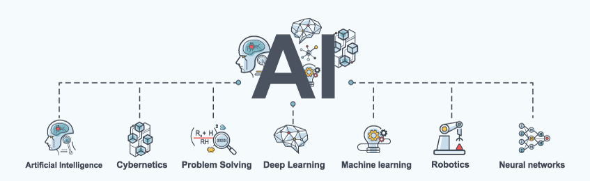

# What is Artificial Intelligence

Artificial intelligence (AI) is the general study of making intelligent machines. Intelligence is considered here as the ability to learn and understand in order to make decisions and solve problems.

A more updated definition:

> Artificial intelligence (AI) systems are software (and possibly also hardware) systems designed by humans that, given a complex goal, act in the physical or digital dimension by perceiving their environment through data acquisition, interpreting the collected structured or unstructured data, reasoning on the knowledge, or processing the information, derived from this data and deciding the best action(s) to take to achieve the given goal. AI systems can either use symbolic rules or learn a numeric model, and they can also adapt their behavior by analyzing how the environment is affected by their previous actions.
> As a scientific discipline, AI includes several approaches and techniques, such as machine learning (of which deep learning and reinforcement learning are specific examples), machine reasoning (which includes planning, scheduling, knowledge representation and reasoning, search, and optimization), and robotics (which includes control, perception, sensors, and actuators, as well as the integration of all other techniques into cyber-physical systems) (Lemonne, 2018).

Artificial Intelligence (AI) has transitioned from being part of the science fiction literature genre to a technological and philosophical disciple that shapes 21st-century history.  A sleuth of technologies like machine learning, neural networks, robotics, etc., are associated with the field contributing to practical applications like speech and face recognition, email-spam filtering, etc.

The formal study of the field can be dated to the early decades of the 20th century, where cybernetics first studied automatic control systems, and the foundations for technologies like neural networks, expert systems were first introduced. The high computational demands of AI technology set the field to a standstill until the early 1990s, where computing power started increasing at affordable prices for the field to remerge and become a reality for day-to-day business applications and a core research field.

Apart from a brief history into the evolution of AI in modern times in this section, you will see one of its core technologies – neural networks or artificial neural networks, as they are officially referred to along with one of their core areas of application – natural language processing.

AI’s transformational effect on business is nowadays similar to the visions and impact of modern products like self-driving vehicles, reusable launch rockets, and intelligent robots. Using AI to enhance business operations, also known as enterprise cognitive computing (Tarafdar, Beath, & Ross, 2019), involves developing software and algorithms that support organizational processes. Apart from the efficiency in terms of execution speed that such application provides they allow for better analysis of problems and decisions.

While organizations are slow in the adoption of AI, the future outlook is optimistic about the value-creating potential of AI in automation and decision making. Developing strategies to explore and materialize the potential of AI or even using AI to develop strategies is and will be a much-valued competence in the future.

The true challenge for AI as an organizational asset is “solving the tasks that are easy for people to perform but hard for people to describe formally” (Goodfellow et al., 2016). This includes problems like recognizing faces, walking from one place to another without thinking, etc. Allowing computers to experience and understand the world as interconnected concepts that combine to form higher-level concepts without human intervention is the ultimate goal of AI. This layered approach of building concepts upon concepts forming deep graphs is called deep learning.

While AI applications can assist businesses and organizations in improving their offerings to the world, they are also viewed with a suspicion about their purpose and intent as replacements of humans in the workplace and as threats to our ways of life. Minimizing human error and enabling new experiences and abilities for people like, for example, predicting medical conditions with higher accuracy than humans, will allow AI to be fairer and more inclusive worldwide.

Additionally, you need to ensure that AI systems behave as intended, and they do not pose a threat to your privacy and security. Making sure that attackers cannot interfere with your AI-supported systems is a major challenge and cannot be overlooked by corporations and governments, especially for critical applications. Security, privacy, fairness, and interpretability are essential characteristics of and compliance requirements of current and future AI systems.

In this first week of the course, you will be introduced to the evolution of key AI technologies like neural networks and natural language processing and their implications for business and research.

## References

Lemonne, E. (2018, December 17). Ethics Guidelines for Trustworthy AI. Retrieved August 17, 2019, from FUTURIUM - European Commission website.

Tarafdar, M., Beath, C. M., & Ross, J. W. (2019). Using AI to enhance business operations. MIT Sloan Management Review. 4,37.

Goodfellow I., Bengio, Y., & Courville, A. (2016). Deep Learning, MIT Press.