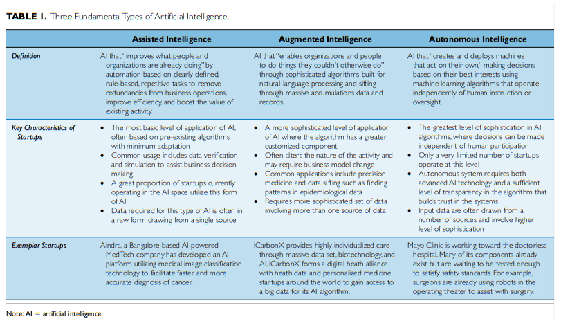

# Readings

## A (Very) Brief History of Artificial Intelligence (2005)

Buchanan, B. G. (2005). A (Very) Brief History of Artificial Intelligence. AI Magazine, 26(4), 53–60. [EBSCO](https://search-ebscohost-com.proxy1.ncu.edu/login.aspx?direct=true&db=ofs&AN=501189619&site=eds-live).  [BriefHistory.pdf](BriefHistory.pdf).

> This paper provides a brief history of AI introducing basic concepts and principles.

The voyage toward AI has been a long journey.  During the early 1900s models attempted to reproduce human intelligence.  The defacto platform was to build solvers for chess, which reached the point of DeepBlue beating the chessmaster in 1997.  Along the way solvers began with heuristics that would reduce the trial-and-error search space.  Creating new and innovative heuristics became the state of the art solution deep into the 1960s.

> The most central idea of the pre-1962 period was that of finding heuristic devices to control the breadth of a trial-and-error search. A close second preoccupation was with finding effective techniques for learning. In the post-1962 era the concern became less with "learning" and more with the problem of representation of knowledge (however acquired) and with the related problem of breaking through the formality and narrowness of the older systems. The problem of heuristic search efficiency remains as an underlying constraint, but it is no longer the problem one thinks about, for we are now immersed in more sophisticated subproblems, e.g., the representation and modification of plans" (Minsky 1968, p. 9).

Another common challenge was text parsing and translation.  Original approaches would use large dictionaries and do literal term replacements, however, these results were laughable and broadly defunded.  Modern methods extract both the raw phrases and the conversational context.

In the middle were various programming languages (e.g., LISP) to address these challenges.  These systems generally follow an algebraic solver approach.  While primative by modern standards, it was possible to defeat humans at board games.  Others researchers found success with rule based models that would even introduce erroneous decisions to more closely mimic humans.

## From Artificial Intelligence to Augmented Age An Overview (2018)

Lukac, D., Milic, M., & Nikolic, J. (2018). From Artificial Intelligence to Augmented Age An Overview. 2018 Zooming Innovation in Consumer Technologies Conference (ZINC), Zooming Innovation in Consumer Technologies Conference (ZINC), 2018, 100–103. [DOI](https://doi-org.proxy1.ncu.edu/10.1109/ZINC.2018.8448793).  [AugmentedAge.pdf](AugmentedAge.pdf).

> This paper provides an overview of modern AI

The short article covers the people that innovated across various sciences to produce artificial intelligence. These efforts began in ancient Greece with the ideas coming to fruition around the 1930s through formalization of mathmatical models.

Artificial intelligence comes in four categories:

- Systems that think like humans;
- Systems that act like humans;
- Systems that think rationally;
- Systems that act rationally.

## A Review of Artificial Intelligence Methods for Data Science and Data Analytics: Applications and Research Challenges (2018)

Krishna, C.V.; Rohit, H.R. Mohana. (2018). A Review of Artificial Intelligence Methods for Data Science and Data Analytics: Applications and Research Challenges.  2018 2nd International Conference on I-SMAC (IoT in Social, Mobile, Analytics and Cloud) (I-SMAC)I-SMAC (IoT in Social, Mobile, Analytics and Cloud) (I-SMAC). 30-31 Aug. 2018. Palladam, India, India. [DOI](https://doi-org.proxy1.ncu.edu/10.1109/I-SMAC.2018.8653670). [MethodDataScience.pdf](MethodDataScience.pdf).

> This paper describes the methods of AI, applications, hardware and software resources used, and some of the research challenges we are facing today.

### What lead to modern AI technologies

Artifical intelligence dates back to 1951 with programs written for [Ferranti Mark 1 Machine](https://en.wikipedia.org/wiki/Ferranti_Mark_1).  Roughly a decade later in 1965 Deep Learning is introduced by Alexey Grigoryevich Ivakhnenko and Valentin Grigor'evich Lapa.  Around 1997 recurrent neural networks are established and later exploited through GPU technologies of the 2000-10 era.  Modern systems consume substantually more layers using broad technology to deliver ever complicated computational models.

### What are common strategies

In [TIM-8130 Data Mining](https://github.com/dr-natetorious/TIM-8130-Data_Mining) many of these strategies are investigated in-depth.  However, a summary is provided here for completion of the articles notes.

| Domain | Algorithm | Description|
|---------|----------|------------|
| Machine Learning| Decision Trees| hierarchial trees of learned rules|
| Machine Learning|  SVG | Supervised classification and regression |
| Machine Learning| Bayes| Independent feature classification |
| Deep Learning| Back Prop | Creates a linear approximation of non parametric function|
| Deep Learning| Skip-Gram| NLP strategy for grouping sentence fragements|

### What are open problems with AI

- Reasoning and problem solving; large models are ambigious and require additional considerations
- Security; similar to notes from [TIM 8301 Principals of Cybersecurity](https://github.com/dr-natetorious/TIM-8301-Principals_of_CyberSecurity) there is no notion of integrity checks within ML
- Motion and manipulation; robots in dynamics environments is complex problem that requires more efforts.

## Demystifying AI: What Digital Transformation Leaders Can Teach You about Realistic Artificial Intelligence (2019)

Brock, J. K.-U., & von Wangenheim, F. (2019). Demystifying AI: What Digital Transformation Leaders Can Teach You about Realistic Artificial Intelligence. California Management Review, 61(4), 110–134. [DOI](https://doi-org.proxy1.ncu.edu/10.1177/1536504219865226). [Demystifying.pdf](Demystifying.pdf).

> In the context of digital transformation, a framework for successfully implementing AI is presented in this paper.

### What are the DIGITAL challenges

For every success story deploying machine learning; there are dozens of failures.  The authors collected survey results from senior managers and review the responses.  When reviewing the leaders and laggers the biggest difference was leadership and preparation.  They created the DIGITAL mnemonic to weed out these challenges upfront and improve the probability of success.

### What is the Business Impact and Challenges

> Interestingly, the application of AI was typically an integral part of a firm's digital transformation project. With the exception of isolated experimentation with specific AI techniques such as deep learning, AI was not used in isolation, but as one technological element of several technologies aimed at enhancing a firm's present and future business (pg. 115).

Similar to other technologies the business must plan and make an conscienceous investment.  This requires building up internal capabilities to deliver on the broader vision.  When senior leadership assumes that AI operates as a magic black box, they are unlikely to succeed.  Instead, _transformation requires transforming_, and this is an explicit and intentional action.

> These results suggest that, just like with other technological innovations in the past, to realize the potential of the new digital technology, AI requires specific organizational capabilities as the firm and the new technology align for best application and impact (pg. 116).

- Strategic capabilities: digital strategy and digital business development skills.
- Technology capabilities: skills in new digital technologies such as AI or IoT.
- Data capabilities: data science skills.
- Security capabilities: cybersecurity skills.

> Reflecting the importance of digital skills, the main challenge for all firms is lack of skilled staff and knowledge in digital technologies, which was mentioned as an implementation challenge by more than half of the firms combined. Lack of organizational agility, internal resistance to change, security risks, lack of leadership and sufficient funding, as well as the challenge of integrating new
digital technology with existing technology were stated as challenges by about a quarter of the firms each. [...] `Contrary to our expectations, we uncover few differences in terms of challenges perceived by leaders versus laggards` (pg. 119).

### What does being grounded mean

> Following the insights derived from more than 7,000 projects worldwide, we `conclude that firms are mainly applying the new digital technology to improve their existing business(es)` (see Figure 3). The reported business impacts of the DX leaders also suggest a grounded approach with impacts such
as improving the existing offering, increasing revenue, or enhancing operational efficiency (see Figure 6). Managers embarking on AI projects should take this insight as suggestive of a rather grounded approach to AI, at least initially. `Rather than pursuing high-flying "pie-in-the-sky" projects, firms should "start small" with AI and base the project in their existing core business(es)`. Our opening case
illustrated this: a focused application area and a relatively small project size (pg 125).

### What does be integral mean

> `Successful firm-wide AI implementations require an integral, holistic approach`. Being integral comes in six flavors: strategy, processes, data management, technology alignment, employee engagement, and culture. [...] As soon as AI leaves the experimental, feasibility-testing lab environment and is applied to a real business case, _managers should first make sure it is embedded in and supportive of the firms' digital strategy_ (pg 126). [...] `Integrated data management requires technology alignment`. Lack of it was one of the key barriers to AI success and successful alignment one of the key success factors we identified.  [...] Last, integral implies managers should ensure employee engagement and a supportive culture.

## The Feeling Economy: Managing in the Next Generation of Artificial Intelligence (AI) (2019)

Huang, M.-H., Rust, R., & Maksimovic, V. (2019). The feeling economy: Managing in the next generation of artificial intelligence (AI). California Management Review, 61(4), 43–65. [DOI](https://doi-org.proxy1.ncu.edu/10.1177/0008125619863436). [FeelingEconomy.pdf](FeelingEconomy.pdf).

Artificial intelligence has exploded across business processes and is quickly taking over mechanical and repetitive tasks (aka `Thinking Economy`).  More recently, systems are moving into the `Feelings Economy` and learning to `perform emotional and interpersonal tasks` as well.  While many people believe that jobs the focus on these soft-skills will be immute from displacement, the authors predict the opposite.  Using gov't data (O*NET by US Labor Dept) they highlight a growing trend across toward domination of machines.

> Our analysis concludes that in the Feeling Economy, jobs will emphasize feeling tasks more, and workers will need to get more people-oriented, rather than more data-oriented, if they wish to leverage the benefits of thinking AI. Even for managerial jobs that have always had both people-focused tasks (i.e., communicating and coordinating with people), as well as thinking-focused tasks (i.e., analyzing data or information), our empirical evidence shows that the "soft" aspects of managerial jobs are becoming even more important and will need to be prioritized, compared with thinking and analytical skills, in opposition to what many people might generally assume or take for granted in this big data age (pg 44)

### What are the stages of AI evolution

The authors provide these definitions and comparisons between them on page 46.

- _Mechanical intelligence_ is the capability to do mechanical and repetitive tasks with relatively limited amounts of learning or adaptation.
- _Thinking intelligence_ is the capability to analyze and make decisions rationally (or boundedly rationally) and involves learning and adapting systematically from data autonomously.
- _Feeling intelligence_ is the capability to recognize, emulate, and respond appropriately to human emotions.

### How will this influence future personas

## AI as a Growth Engine (2019)

Garbuio, M., & Lin, N. (2019). Artificial intelligence as a growth engine for health care startups: Emerging business models. California Management Review, 61(2), 59–83. [DOI](https://doi-org.proxy1.ncu.edu/10.1177/0008125618811931).  [GrowthEngineHealthCare.pdf](GrowthEngineHealthCare.pdf).

The authors performed a three year survey of startups and health care prationiners to understand _how incorporating artifical intelligence results produces business value in HealthCare systems_.  From a list of 106 innovators according to Forbes, they selected a subset of thirty that span the entire vertical.

### Building the business case

> For a solution to thrive in the marketplace, it needs to begin with a clear definition of the value that is to be created for a particular user. The question of value relates to the question of who is the user that the solution aims to address.

When business leaders began creating [Your.MD](https://your.md), they wanted to `personalize searching for medical information` in a `patient-centric` manner.  The HealthCare industry is frequently behind the curve on industry trends and this capability was generally lacking.  After identifying the problem and user, they began building a system for that narrow slice.  Once that capability was available, then marketing and executive teams could identify delivery platforms (e.g., mobile device) and how best to frame the impact to customers.

> With mobile phones becoming ubiquitous and providing you with computing power on your hands and an easy connection to centralized computing power, there must be a way to get people the health information they need for free when they need it... So mobile phones plus health equals something useful for a lot of people. The original idea was just to give information to people (pg 63).

Meanwhile, Jvoins provides _cognitive clinical success machines_, that help patients rationalize their biometrics, known illnesses, and healthcare costs. Being under or overinsured results in stress or waste on the patients part.  With that consciense value-statement Jvoins `later` built a business model to profit from this service.

### How to select the most suitable AI-technology development strategy

The authors provide a logical decision tree to choose the right technology (pg 78).  Their model is relatively similar to project planning, as discussed in [TIM-7030 Managing Risk Week 4](https://github.com/dr-natetorious/TIM-7030-Managing_Risks_and_Privacy/tree/master/Week4_SecureDevelopment).

1. What stage is the company at?
2. Does the insights from AI rely more on the available data or on the algorithm that can be built
3. What does the company sell?
4. What are the corporate resources available

## Programs with Common Sense (1959)

McCarthy, J (1959). Programs with common sense.  Stanford Computer Science Department. Retrieved from [Stanford.edu](http://www-formal.stanford.edu/jmc/).  [ProgramsWithCommonSense.pdf](ProgramsWithCommonSense.pdf).

The author describes a method for building artifical intelligence by defining rules that support _transitive logic_.  For instance, `can{ walk(a,b), walk(b,c) }` infers the actor could also `walk(a,c)`.  These ideas become more complex as the actions are hierarchialized (e.g., `run vs walk`).

While the paper does not provide a formal proof of these ideas, nor a direct implementation; they propose some potential future directions of research.  [Buchanan](BriefHistory.pdf) made a similar observation that these sorts of ideas build into the foundation that becomes modern machine learning.

I could envision a system that uses this approach to generate contextual graphs.  These graphs could then be traversed to produce semantic statements about a problem.  The problem gets harder when you start thinking about compounded expressions like `begin_commute = if { walk(a,resturant(b)) and is_open(b) }`.  Perhaps a simple agent determines the resturant closes in 30min and its a 35min walk.  However, a smarter system could contextually understand that _running_ reduces the time to a 20min commute.
