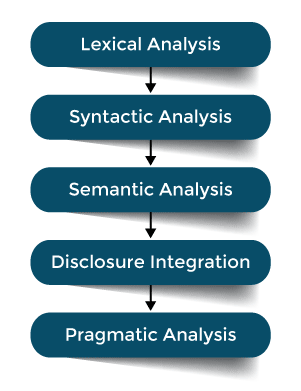

# Natural Language Processing

A core characteristic of human intelligence is language. Natural language processing (NLP) is an AI technology to intelligently process human language. It is typically divided into a function such as a machine translation, summarization, and sentiment analysis. Extracting meaning from text typically includes the five steps outlined in the image below:

Figure 1. The Five Steps of Natural language Processing (NLP)

- Lexical analysis concerns the identification and analysis of the word structure by separating the written text into tokens that form the words of a sentence. Typically, the written text is scanned from left to right, character by character, and grouped into tokens/words.
- Syntactic analysis is the discovery of structure in the tokens/words in accordance with the grammar rules of a language. Here is where nouns, verbs, and the other parts of grammar are identified and connected into phrases. A syntax tree is typically the outcome of this step.
- Semantic analysis checks the semantic consistency of a phrase/sentence. In other words, this is where the connection between the various tokens is established to ensure the appropriate meaning is conveyed. This is done by the grouping of various words while traversing the syntax tree of the previous step.
- Disclosure integration combines previous words or sentences in order to establish the context of current on next in line words and sentences. Expressed as context-based reasoning, this step established meaning beyond single sentences. If the previous step is seen as attributing meaning to sentences, this step can be seen as attributing meaning to paragraphs.
- Pragmatic analysis is the final step in NLP and concerns the re-interpretation of the actual meaning of the written text in its entirety. This is where relevance to the real-world is established as to when we understand the theme of the conversation between two individuals.

To achieve NLP, neural models and deep reinforcement learning techniques are typically used.
