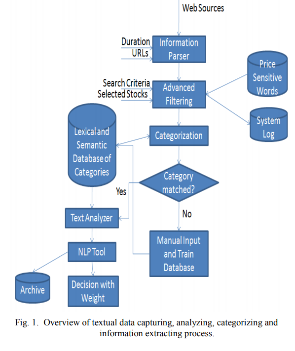
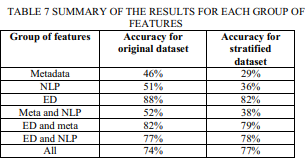
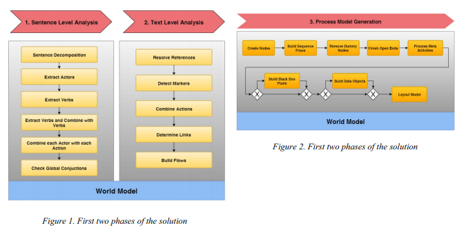
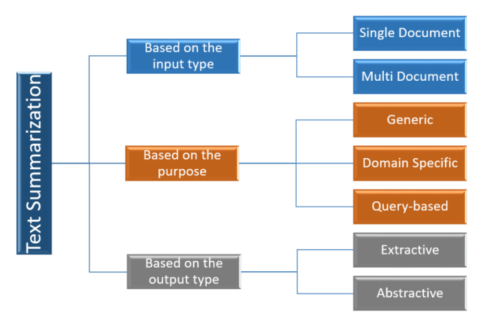

# Readings

## Analysis of stock market using text mining and NLP (2013)

Abdullah, S. S., Rahaman, M. S., & Rahman, M. S. (2013). Analysis of stock market using text mining and natural language processing. 2013 International Conference on Informatics, Electronics and Vision (ICIEV), Informatics, Electronics & Vision (ICIEV), 2013 International Conference On, 1–6. [DOI](https://doi-org.proxy1.ncu.edu/10.1109/ICIEV.2013.6572673). [StockMarketNLP.pdf](StockMarketNLP.pdf).

> The objective of this study is to extract fundamental information from relevant news sources and use them to analyze or sometimes forecast the stock market from the common investor’s viewpoint.

Sounds financial decisions in the market require both technical and fundamental data.  Technical data is easy to derive from statistical models, however fundamental information is generally locked within unstructured free form text.  The authors describe a system for parsing this information from news articles and similar sources.

While their system is effective at tokenizing and classifying, there are many challenges that come from new data formats.  For instance, two journalists could have unique stylistic voices and this leads to custom extensions per source.  However, this critism is more so asking for additional functionality with broader capabilities.  The researchers set out on a narrow scope, and they have an architecture that could potentially handle those additional scenarios given more time and resources.

## We Know Where You Are Tweeting From (2014)

A. Alsudais, G. Leroy and A. Corso, "We Know Where You Are Tweeting From: Assigning a Type of Place to Tweets Using Natural Language Processing and Random Forests," 2014 IEEE International Congress on Big Data, Anchorage, AK, 2014, pp. 594-600, [DOI](https://doi-org.proxy1.ncu.edu/10.1109/BigData.Congress.2014.91). [KnowWhereYouTweetFrom.pdf](KnowWhereYouTweetFrom.pdf)

> This paper showcases the use of the Random Forest AI technique to identify six location categories Tweeter users like eating out, hotels, nightlife, shopping, and shows.

In 2014, there were over a billion tweets per day and that volume has only increased.  This presents a wealth of potential knowledge, though in a highly unstructured manner.  The authors collected tweets and then attempted to classify them into various categories like food or nightlife.  While building the model additional features such as metadata about businesses tagged and the time of day provided additional hints at the right answer.  All of these facts were then sent into a random forest.

Choosing the textual words to include in the NLP model followed this process:

1. Split the data set as 60/40 (train/test)
2. Group the messages into pre-labeled buckets
3. Identity the top-10 most common unique words for that bucket
4. These became the vocabulary to train

One point of critism is that the NLP aspect does not appear to provide any real-value. According to their results section (pg. 598)-- the _Entity Description (ED)_ provides ~80% accuracy on its own.  Meanwhile, NLP on its own was right only 50% of the time, granted there are roughly six categories.  Including the metadata (e.g., time of day) decreases the accuracy, and that might suggest that overfitting is taking place.

## An analysis of the use of NLP systems in business (1997)

Sidhu, J., & Hinde, C. J. (1997). An analysis of the use of natural language processing systems in business. Behaviour & Information Technology, 16(3), 145–156. [DOI](https://doi-org.proxy1.ncu.edu/10.1080/014492997119879). [NLP_in_Business.pdf](NLP_in_Business.pdf).

> The paper discusses research on Natural Language interrogation systems along with their advantages and disadvantages.

## Extracting Business Process Models Using NLP Techniques (2017)

K. Sintoris and K. Vergidis, "Extracting Business Process Models Using Natural Language Processing (NLP) Techniques," 2017 IEEE 19th Conference on Business Informatics (CBI), Thessaloniki, 2017, pp. 135-139, [DOI](https://doi-org.proxy1.ncu.edu/10.1109/CBI.2017.41). [ExtractBusinessProcess.pdf](ExtractBusinessProcess.pdf)

> This paper discusses how Natural Language Processing can be used to retrieve the components of a business process model from documents.

Business process documentation is full of juicy golden nuggets, however, extracting that information is highly complex.  The authors give a preview of a system they are building that can derive a semantic model that represents these processes.

They accomplish this through a series of transformation steps that (1) perform sentence level analysis; (2) followed by text level analysis.  This enables them to build a world model that understands the specifics of the organizaiton.

## An Introduction of Deep Learning Based Word Representation Applied to Natural Language Processing (2019)

Fu, Z. (2019). An Introduction of Deep Learning Based Word Representation Applied to Natural Language Processing. 2019 International Conference on Machine Learning, Big Data and Business Intelligence (MLBDBI), Machine Learning, Big Data and Business Intelligence (MLBDBI), 2019 International Conference On, 92–104. [DOI](https://doi-org.proxy1.ncu.edu/10.1109/MLBDBI48998.2019.00025). [DeepLearningToNLP.pdf](DeepLearningToNLP.pdf).

> This paper provides an explanation of the theories behind two language models (autoencoding and autoregressive).

## A Survey on NLP based Text Summarization for Summarizing Product Reviews (2020)

R. Boorugu and G. Ramesh, "A Survey on NLP based Text Summarization for Summarizing Product Reviews," 2020 Second International Conference on Inventive Research in Computing Applications (ICIRCA), Coimbatore, India, 2020, pp. 352-356, [doi](https://doi-org.proxy1.ncu.edu/10.1109/ICIRCA48905.2020.9183355). [NLP_TextSummarization.pdf](NLP_TextSummarization.pdf).

It can be challenging to read lengthy product reviews or get the gist of verbose multi-document corpuses.  Researchers are assessing strategies for either _extracting text_ or _abstracting text_ to provide summaries for the reader.  Identifying and extracting key phrases is a complex task, but is well studied.  The more advanced problem is coming up with an abstract, which reframes and condenses the ideas of the information as whole.

The authors focus the paper on a literature review of various strategies, such as seq2seq and word embedding algorithms that appear in many recurrent neural networks (RNN) solutions.  Other approaches were more unique like building a DAG with weighted edges equal to the _Cohesion Factor_.  Then a cost function maximizes the selected sentenses according to their total weights.

## Survey of Various AI Chatbots Based on Technology Used (2020)

S. Singh and H. K. Thakur, "Survey of Various AI Chatbots Based on Technology Used," 2020 8th International Conference on Reliability, Infocom Technologies and Optimization (Trends and Future Directions) (ICRITO), Noida, India, 2020, pp. 1074-1079, [doi](https://doi-org.proxy1.ncu.edu/10.1109/ICRITO48877.2020.9197943). [ChatBots.pdf]

## The survey: Text generation models in deep learning

Touseef Iqbala, Shaima Qureshi (2020). The survey: Text generation models in deep learning. Journal of King Saud University - Computer and Information Sciences. Available online 13 April 2020. [doi](https://doi-org.proxy1.ncu.edu/10.1016/j.jksuci.2020.04.001). [TextGeneration.pdf](TextGeneration.pdf)

## Analysis of Personality Traits using Natural Language Processing and Deep Learning (2020)

Pradhan, T., Bhansali, R., Chandnani, D., & Pangaonkar, A. (2020). Analysis of Personality Traits using Natural Language Processing and Deep Learning. 2020 Second International Conference on Inventive Research in Computing Applications (ICIRCA), Inventive Research in Computing Applications (ICIRCA), 2020 Second International Conference On, 457–461. [doi](https://doi-org.proxy1.ncu.edu/10.1109/ICIRCA48905.2020.9183090). [PersonalityTraits.pdf](PersonalityTraits.pdf).
