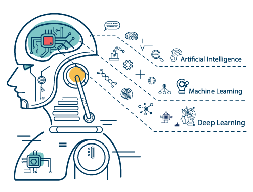

# Characteristics of Machine Learning

This week, you will explore machine learning (ML) as one of the core AI technologies in use by businesses today. This technology aims to understand and develop computer software that can learn from experience. While in the past, the amount of data produced by business function were within the capabilities of human processing and cognition nowadays, the amount of data produced surpasses your ability to consume them. Automating the process of analyzing data and deriving meaning is a reality that many businesses are facing and one that many more will face in the near future.

Deriving meaning for business functions from data generated by both humans and devices requires the processing of various forms of data, including text, images, audio, and video. ML aims at the idea of automating the learning process without the intervention of humans and without hardcoding solutions. The development of ML solutions differs from the traditional programming paradigms in that you “train” algorithms/software to learn by examples rather than hardcoding instructions. This practice allows the ML software to adjust and improve its evaluations/predictions by itself as new and unknown cases are presented.

A typical example of ML is the Google search engine that provides a recommendation as soon as one starts typing a query and adjust the results as we complete the query. Some of its more advanced features even allow one to search by submitting an image of what they are seeking.
