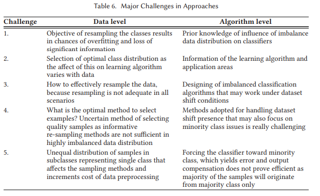

# Readings

## Overview of the State of the Art in Embedded Machine Learning (2018)

Andrade, L., Prost-Boucle, A., & Petrot, F. (2018). Overview of the state of the art in embedded machine learning. 2018 Design, Automation & Test in Europe Conference & Exhibition, 2018, 1033-1038. [DOI](https://doi-org.proxy1.ncu.edu/10.23919/DATE.2018.8342164). [OverviewEmbeddedLearning.pdf](OverviewEmbeddedLearning.pdf).

> This paper provides an overview of the application of neural network architectures in embedded applications.

## Explaining Explanations: An Overview of Interpretability of Machine Learning (2018)

L. H. Gilpin, D. Bau, B. Z. Yuan, A. Bajwa, M. Specter and L. Kagal, "Explaining Explanations: An Overview of Interpretability of Machine Learning," 2018 IEEE 5th International Conference on Data Science and Advanced Analytics (DSAA), Turin, Italy, 2018, pp. 80-89, [DOI](https://doi-org.proxy1.ncu.edu/10.1109/DSAA.2018.00018). [ExplainingExplainations.pdf](ExplainingExplainations.pdf).

> Recent work on explanatory artificial intelligence is presented in this paper. The aim is to develop technology that can provide explanations of the decisions made by AI.

There are many open problems within `Explainable AI (XAI)`, which asks how blackbox NN derive at decisions.  Without a clear explaination there are risks to adoption of machine learning in some mission critical applications.  The European Union now requires citizens have the _Right to an explaination_ for any algorithm that makes a significant decision on their behalf.  For instance, prison sentencing systems might be inheritently bias and there needs to be mechanisms to elevate those biases.

The authors state that its important to frame explaination problems as "why" and "why-should" questions, and then rate the quality of the answer based on the need of _follow up why_ questions.  Producing these questions typically falls into buckets:

- *Attention Networks*, similar to [NLP Transformers](../../Week3_NLP/Videos), measure the influence of features against one-another
- *Disentanglement Representations*, similar to Principal Component Analysis (PCA), examines the relationship of feature correlations
- *Generative Explanations*, use NLP to emit a "because" statement

## A Review of Artificial Intelligence Methods for Data Science and Data Analytics: Applications and Research Challenges (2018)

Please see notes from [Week 1](../Week1_Describe/Readings); those comments are not repeated here.

## From Cloud Down to Things: An Overview of Machine Learning in Internet of Things (2019)

F. Samie, L. Bauer and J. Henkel, "From Cloud Down to Things: An Overview of Machine Learning in Internet of Things," in IEEE Internet of Things Journal, vol. 6, no. 3, pp. 4921-4934, June 2019, [DOI](https://doi-org.proxy1.ncu.edu/10.1109/JIOT.2019.2893866). [CloudDownToThings.pdf](CloudDownToThings.pdf).

> This paper discusses the use of machine language in Internet of Things in a ranger of domains from embedded to the cloud.

The authors perform an detailed survey of uses cases for IoT and machine learning, then deep dive into algorithms and strategies that can address those scenarios.  This is a reference for a broad collection of ideas.

## Sentiment analysis using machine learning for business intelligence (2017)

S. Chaturvedi, V. Mishra and N. Mishra, "Sentiment analysis using machine learning for business intelligence," 2017 IEEE International Conference on Power, Control, Signals and Instrumentation Engineering (ICPCSI), Chennai, 2017, pp. 2162-2166, [DOI](https://doi-org.proxy1.ncu.edu/10.1109/ICPCSI.2017.8392100). [SentimentAnalysis.pdf](SentimentAnalysis.pdf).

> In this sentiment, analysis classification is demonstrated as an effective method for examining textual data coming from variety of resources on internet.

## Modern Machine Learning for Cyber-Defense and Distributed Denial-of-Service Attacks (2019)

R. C. Paffenroth and C. Zhou, "Modern Machine Learning for Cyber-Defense and Distributed Denial-of-Service Attacks," in IEEE Engineering Management Review, vol. 47, no. 4, pp. 80-85, 1 Fourthquarter,Dec. 2019, [DOI](https://doi-org.proxy1.ncu.edu/10.1109/EMR.2019.2950183). [ML_for_DDos.pdf](ML_for_DDos.pdf).

> This article discusses methods for detecting and mitigating DoS attacks with a focus on techniques that leverage machine learning algorithms.

## Machine Learning for Classification of Economic Recessions (2019)

B. Jackson and M. Rege, "Machine Learning for Classification of Economic Recessions," 2019 IEEE 20th International Conference on Information Reuse and Integration for Data Science (IRI), Los Angeles, CA, USA, 2019, pp. 31-38, [DOI](https://doi-org.proxy1.ncu.edu/10.1109/IRI.2019.00019). [ClassificationEconomics.pdf](ClassificationEconomics.pdf)

> This paper describes machine learning methods for the determination of business cycle turning points.

The authors compare the accuracy of both K-NN (Nearest neighbors) and NN (Neural network) to classify business cycles, which are either expansive or regressive in nature.  They also use a `Kalman Filter` to smooth out noise within the time series data.  One of the challenges they needed to overcome is `comovement` as that causes inter-relations between the variables and skews results.  Using `Dynamic Factor Markov-Switching` addresses this issue by modeling volatility more efficiently than standard models.

## Machine Learning for Product Classification (2019)

Hang, W., & Banks, T. (2019). Machine learning applied to pack classification. International Journal of Market Research, 61(6), 601–620. [DOI](https://doi-org.proxy1.ncu.edu/10.1177/1470785319841217). [PackClassification.pdf](PackClassification.pdf).

> This article reviews various ML methods and then outlines tests using these methods.

## A Systematic Review on Imbalanced Data Challenges in Machine Learning: Applications and Solutions (2019)

Kaur, H., Pannu, H. S., & Malhi, A. K. (2019). A Systematic Review on Imbalanced Data Challenges in Machine Learning: Applications and Solutions. ACM Computing Surveys, 52(4), 1–36. [DOI](https://doi-org.proxy1.ncu.edu/10.1145/3343440). [ImbalancedDataChallenges.pdf](ImbalancedDataChallenges.pdf).

> This article discusses a comparative analysis of the various issues relating to data used in machine learning.

Many real-world datasets have majority and minority classes within them, such as 90% men versus 10% women. These situations lead to prediction skews that favor the majority case disporptionately, resulting in lower accuracy in the minority group.

### What strategies exist for addressing these challenges

### What challenges exist with sampling

### What learning algorithms are available

