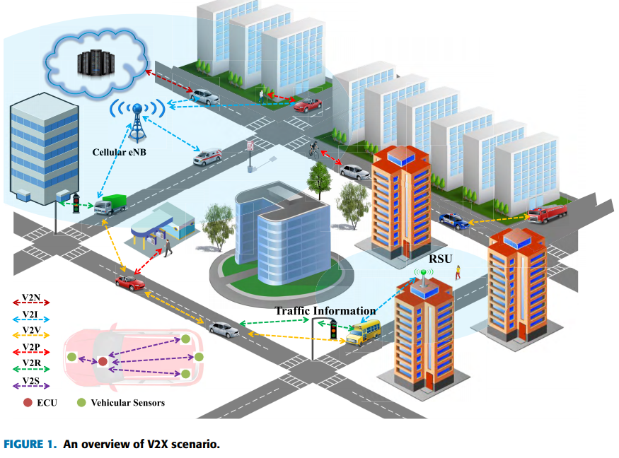
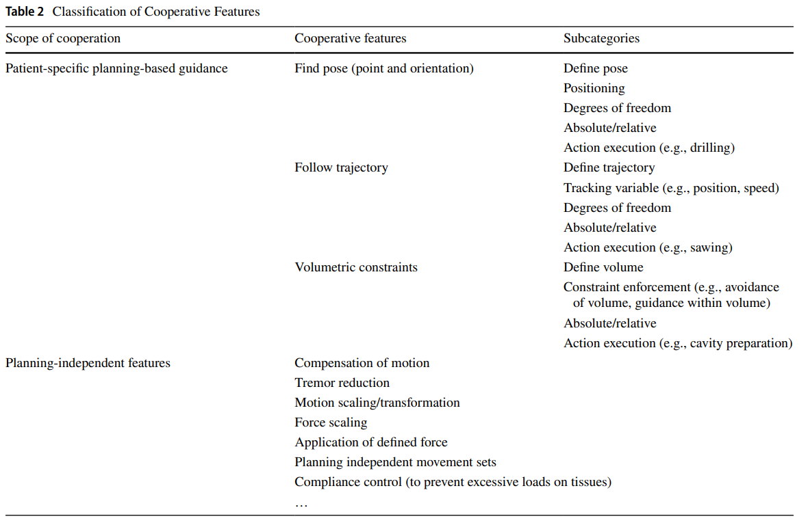

# Readings

## Agency Plus Automation (2019)

Heer, J. J. (2019). Agency plus automation: Designing artificial intelligence into interactive systems. PNAS Proceedings of the National Academy of Sciences of the United States of America, 116(6), 1844–1850. [DOI](https://doi-org.proxy1.ncu.edu/10.1073/pnas.1807184115). [AgencyAutomation.pdf](AgencyAutomation.pdf).

> Three case studies of interactive systems are discussed in this paper that integrates proactive support into the system to support learning and improve outcomes.

The field of `Human Computer Interactions (HCI)` led to innovations, such as GUI (Graphical User Interfaces) and the mouse.  In parallel, AI solves many tedious tasks that humans must adhere to.  However, there are several challenges giving all of the control over to the machines such as:

1. Loss of domain expertise (aka use-it-or-lose-it skills)
2. Loss of error handling during catastrophic failure (e.g., plane crashing)
3. Loss of explainability (e.g., why did it do that)

Instead of taking full control of the system, the authors propose using AI to augment and enhance existing human capabilities.  For example, writing an email a `human task` versus grammar checking is an AI enhancement.  These situations appear across numerous other situtations.

### Can you summarize the Data Wrangler example

When data scientist perform ML tasks, 80% of the time goes into curation tasks not specalization tasks.  The Data Wranger Application (DWA) seeks to improve this time distribution by augmenting human capabilities with `predictive AI`.

1. Smart Transformation Hints. While there are an unlimited number of cleaning steps, there are a finite number of _likely actions_.  This asymmetry enables the system to provide "smart hints" on each row and column, then follow up with "action scripts" to apply those mutations.

2. Auto visualization.  Exploring an unknown dataset is another tedious area where machines can look at row and column distributions to surface intelligent graphics.

3. Natural language processing.  Systems that are capable of translating a pile of data into human ready summaries is an open problem that fuels inventments into multi-billion dollar industries.

## Industrial Age Capacity at Information Age Speed (2019)

MAY, M. T. J. (2019). Industrial Age Capacity at Information Age Speed. Strategic Studies Quarterly, 13(2), 68–89. [EBSCO](https://search-ebscohost-com.proxy1.ncu.edu/login.aspx?direct=true&db=tsh&AN=136903502&site=eds-live). [IndustrialAge.pdf](IndustrialAge.pdf).

> This article examines the potential for AI in defense logistics and the DOD's relationship with industry to meet the logistical demands of the modern battlespace.

The United States has been the world super power by outspending other countries in terms of scientific innovation and military force.  However, as the world continues to evolve these investments are unlikely to soley maintain that position.  For instance, China increases has increased funding by 18% (2018 = 409B/yr) annually for 20 years, versus the US adds 4% (498B/yr).

Another set of challenges exist that keeping large military forces on constant vigal is not sustainable.  Consider the middle east conflict, where the US "won" but not before spending trillions of dollars with debate-able results.  Continuing to scale that strategy to globally should eventually deplete the country by spreading itself too thin.

Instead, the authors propose that logistical operations transition to human augmentation processes, and those technologies handle this aspect.  This frees up the humans to focus on more value-differetiation such as leading the robotic strike, versus boots on the ground.

> This world in arms is not spending money alone. It is spending the sweat of its laborers, the genius of its scientists, the hopes of its children. The cost of one modern heavy bomber is this: a modern
brick school in more than 30 cities. It is two electric power plants, each serving a town of 60,000 population. It is two fine, fully equipped hospitals. It is some 50 miles of concrete highway. We
pay for a single fighter plane with a half million bushels of wheat. We pay for a single destroyer with new homes that could have housed more than 8,000 people. This, I repeat, is the best way of life to be found on the road the world has been taking. (President Dwight D. Eisenhower, 1961)

## Amazon Robotics (2020)

Amazon Robotics. (2020) Our Vision. [https://www.amazonrobotics.com](https://www.amazonrobotics.com).

> The site presents Amazon’s vision of automation. Their approach is to continually reimagine the present and make connections that provide solutions to complex problems.

## Artificial Intelligence(AI), Automation, and its Impact on Data Science (2017)

R. Boire, "Artificial intelligence(AI), automation, and its impact on data science," 2017 IEEE International Conference on Big Data (Big Data), Boston, MA, 2017, pp. 3571-3574, [DOI](https://doi-org.proxy1.ncu.edu/10.1109/BigData.2017.8258349). [ImpactOnDataScience.pdf](ImpactOnDataScience.pdf).

> This paper discusses how data science addresses business needs through the transformation AI enabled.

Today (in 2017), data scientist spend less time doing technical hard-skill operations than they did 10 years ago (in 2007).  Looking forward (in 2027), the requirement for these deep technical skills will be even less due to the augmentation of machine learning. So, what does that mean for data scientistic?

The transformation toward a focus on soft-skills and hybrid-skills will be the key differentation of _should I employee a person_ versus _should I buy a system_.  Ex: machine can automate large portions of analysis already using point and click interfaces.  Factor in the ubiquitous availability of commodity cloud computing, and it becomes more economical to bruteforce those clicks, than pay someone to do the task.  However, during this area humans will likely still dominate machines at `applying the results to the business case`.  That action is highly subjective and requires an abstract context that is challenging to replicate.

Though as we look further ahead (in 2037), perhaps that's no longer true, and machines do surpass us.  Until then the value-differentiation is and will continue to be the soft-skills, that lightly touches into the technical relm.

## Artificial Intelligence for Vehicle-to-Everything (2019)

W. Tong, A. Hussain, W. X. Bo and S. Maharjan, "Artificial Intelligence for Vehicle-to-Everything: A Survey," in IEEE Access, vol. 7, pp. 10823-10843, 2019, [DOI](https://doi-org.proxy1.ncu.edu/10.1109/ACCESS.2019.2891073). [VehicleToEverything.pdf](VehicleToEverything.pdf).

> A comprehensive review of AI research in the area vehicle-to-everything systems is presented in this paper as well as some of the challenges that need to be addressed to realize the full potential of this new technology.

### Was this topic previously covered?

A deep-dive into the role of V2X and smart cities is covered in:

- [TIM-7010 Mobile & Networks Week 7](https://github.com/dr-natetorious/TIM-7010-Computer_Networks_and_Mobile_Computing/blob/master/Section_4_Application/Week7_Darpa_SmartCity/) Interactions of vehicle communication networks
- [TIM-8120_Distributed_Systems Week 3](https://github.com/dr-natetorious/TIM-8120_Distributed_Systems/blob/master/Week3_SharedResource_CommunicationMechanisms/Readings/ServiceDiscovery/VANET/README.md) Vehicular Ad-Hoc Networks (VANET)
- [TIM-8110-Programming_Languages_and_Algorithms Week 8](https://github.com/dr-natetorious/TIM-8110-Programming_Languages_and_Algorithms/tree/master/Week8_Experiment) Using DeepRacer to understand autonomous vehicles

## A service-oriented simulation integration platform for hierarchical manufacturing planning and control (2016)

Xu, D., Nageshwaraniyer, S. S., & Son, Y.-J. (2016). A service-oriented simulation integration platform for hierarchical manufacturing planning and control. International Journal of Production Research, 54(23), 7212–7230. [DOI](https://doi-org.proxy1.ncu.edu/10.1080/00207543.2016.1221535). [HierarchicalManufacturing.pdf](HierarchicalManufacturing.pdf).

> In this paper, a coherent and comprehensive distributed simulation platform is proposed to support hierarchical manufacturing planning and control.

This paper was previously discussed in [TIM-8120 Distributed Systems Week 2](https://github.com/dr-natetorious/TIM-8120_Distributed_Systems/blob/master/Week2_Fundamentals_Software/Readings/SOA/README.md#a-service-oriented-simulation-integration-platform-for-hierarchical-manufacturing-planning-and-control-2016).

## Surgical Robotics (2019)

Schleer, P., Drobinsky, S., de la Fuente, M., & Radermacher, K. (2019). Toward versatile cooperative surgical robotics: a review and future challenges. International Journal of Computer Assisted Radiology and Surgery, 14(10), 1673–1686. [DOI](https://doi-org.proxy1.ncu.edu/10.1007/s11548-019-01927-z). [SurgicalRobotics.pdf](SurgicalRobotics.pdf).

> This paper describes the standardization of robotic device profiles that describe essential functional characteristics of cooperative robotic systems.

Human surgeons can make decisions in complex noisy environments, however their capacity decreases porportional to the degrees of freedom (DOF).  The authors use the analogy of riding a bike (3DOF) versus a unicycle (5DOF), which is exponentially more difficult.  Meanwhile, machines are superior at the inverse scenario, never tiring and able to operate in highly dimensional space.  

Instead of asking can the human replace the machine, or vice versa, a better question is to examine the symbiotic relationship of a partnership. The doctor can manage the operation by giving instructions to the machines that execute those commands flawlessly.

> This plurality of surgical robots along with their narrow application felds infuences cost and usability negatively and, consequently, prevents their widespread adoption. Therefore, a modular system design seems to be crucial regarding a versatile adaptation of workspaces, number of DOF, tools for the specifc boundary conditions and needs for each specifc application [10, 20, 21]. Furthermore, according to Spath et al., "fexible automation, rather than the highest degree of automation, is the aim" ([22],
p. 594 (34.4.1)).

### What are the characteristics of a decent AI-partnership

> However, associated potential risks, such as overreliance, dependency on the system and retention of skills, should be considered and analyzed carefully [28, 29, 31, 32]. Abbink et al. [28] propose four guidelines for human–automation interaction: Firstly, the human operator should always remain in control, while smooth shifts in the authority allocation can be experienced or initiated. Secondly, continuous feedback should be available such that limitations of the automation and the functionalities are evident to the operator. Thirdly, there should be a continuous interaction with the automation, and fnally, benefts from either increased performance or reduced workload should exist.

These opinions align with the concerns of Heer's Agency plus automation paper above.

### What is the influence of communication channels

> In summary, a variety of communication channels have been used in surgical robotic applications. The communication channels can be used in conjunction with the classifcation of cooperative features presented (Table 2) for a systematic description of a particular cooperative robotic system. In
particular, the haptic information channel should be further disseminated as it poses many advantages. Furthermore, different classes of synergistic robotic systems exist: handheld, hands-on and telemanipulated devices. Each of the classes mentioned can inherently ofer only certain types of the
cooperative features presented.

## Analysis of the impact of artificial intelligence and robotics on human labour (2019)

Fanafuthi, M. M., Nyawo, J., & Mashau, P. (2019). Analysis of the impact of artificial intelligence and robotics on human labour. Gender & Behaviour, 17(3), 13877–13891. [EBSCO](https://search-ebscohost-com.proxy1.ncu.edu/login.aspx?direct=true&db=ofs&AN=139753131&site=eds-live). [Robotics_HumanLabour.pdf](Robotics_HumanLabour.pdf).

> This paper is a report on some of the work achieved on the topic of automation, in order to answer the question of whether artificial intelligence and robotics will replace human labour.

The role of humans in mechanical operations, such as manufacturing, continues to dwindle because A.I. systems are able to perform these tasks cheaper and with greater consistency.  As the demand for these people decreases, so does the economic benefit (e.g., expected compensation).  Without the ability to make an "honest living" a massive displacement will force those low-skilled workers into different jobs in other industries.

> Citing the World Economic Forum 2016, WebberYoungman (2017) highlights the 10 skills that humans need to thrive in the fourth industrial revolution, based on the use of cyber-physical systems. They are:

- Complex problem-solving
- Critical thinking
- Creativity
- People management
- Coordinating with others (group work activities)
- Emotional intelligence
- Judgement and decision-making
- Service orientation
- Negotiating
- Cognitive flexibility.
