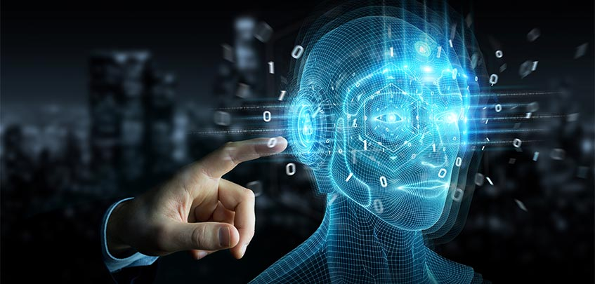

# Intelligent Agents and Collective Intelligence

Intelligent agents technologies refer to autonomous (software) entities that use environmental sensors and actuators to interact with their environment (virtual and/or physical) in an effort to achieve their pre-programmed goal. Such agents are expected to reason about the changes in their environment as well as events and actions causing them, the impact the agent's actions could have on the environment, and the time an event happens or ceases to exist.

Considering the ideal case of a single car on the road is a challenging, but the manageable situation, at least with the technologies you have seen up to now. Adding many more vehicles on the road that move with varying speeds and destinations makes the situation a lot more challenging. The need arises in such cases for individual entities to communicate with each other and optimize their goal, which in the case of transportation would be to get everyone to their destination as fast as possible and as safe as possible. This requires that the machines operate as intelligent agents who can operate autonomously, collaboratively and adapt their behavior to achieve their objective.

Modeling natural phenomena is a similar case, as it requires the representation of various entities at different scales interacting with each other. The case of the human brain is an example of a complex system with a hierarchy of interacting components like individual neurons exchanging electrical signals that, when combined, form the thoughts and actions that allow people to experience the world around them. While the individual neuron can easily be simulated as a system, their collective actions are what give rise to human consciousness. In this module, the relationship between AI and collective intelligence, as well as the implications of this partnership for business strategy and society, are also introduced.
