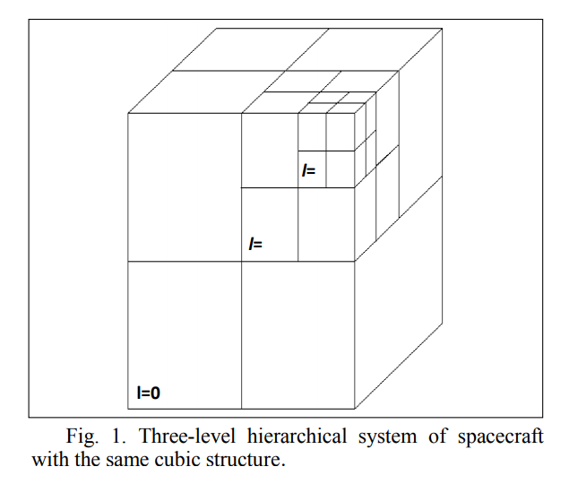

# Readings

## LevelSpace: A NetLogo Extension for Multi-Level Agent-Based Modeling (2020)

Hjorth A, Head B, Brady C, Wilensky U. LevelSpace: A NetLogo Extension for Multi-Level Agent-Based Modeling. Journal of Artificial Societies & Social Simulation. 2020;23(1):1-24. Accessed November 7, 2020. [EBSCOHost](https://search-ebscohost-com.proxy1.ncu.edu/login.aspx?direct=true&db=edo&AN=142602866&site=eds-live). [levelspace.pdf](levelspace.pdf).

## Biologically driven artificial intelligence (2019)

Hole KJ, Ahmad S. Biologically Driven Artificial Intelligence. Computer. 2019;52(8):72-75. doi:10.1109/MC.2019.2917455. [BioDrivenAI.pdf](BioDrivenAI.pdf)

> This paper discusses the differences between human and artificial intelligence and the effort that it will take the latter to catch the former.

### Why are humans still superior to machines

Even though it may be theoretically possible to create superior AI systems that are not biologically inspired, we are far from the goal of creating AI at the level of human intelligence. Most AI learning algorithms, particularly deep learning algorithms, are greedy, brittle, rigid, and opaque. The algorithms are:

- greedy because they demand big data sets to learn
- brittle because they frequently fail when confronted with a mildly different scenario than that in the training set
- rigid because they cannot keep adapting after initial training
- opaque because the internal representations make it challenging to interpret their decisions.

Although these shortcomings are all serious, the core problem is that all AI systems are shallow because they lack abstract reasoning abilities and possess no common sense about the world.

### How has our understanding of biology evolved

The brain was the original inspiration for ANNs, but this is no longer the case; the knowledge behind the ANNs' brain cells is outdated. We now know that biological neurons have multiple physical states and biological networks have far more sophisticated functionality than those in ANNs.

## Application of Cellular Automates in Some Models of AI (2018)

O. S. Makarenko and V. M. Osaulenko, "Application of Cellular Automates in Some Models of Artificial Intelligence," 2018 IEEE First International Conference on System Analysis & Intelligent Computing (SAIC), Kiev, 2018, pp. 1-4, doi: 10.1109/SAIC.2018.8516837. [CellularAutomates.pdf](CellularAutomates.pdf).

> The modeling of the human brain by using cellular automata concepts is discussed in this paper. An interesting aspect of the presentation is the consideration of scaling from individual entities to large-scale population interactions.

Modeling real-world systems is complex due to the scale and variability of interactions.  The authors propose a "smart cube approach" that uses _hierarchical series of discrete systems to build up macro systems_.  This solution is showing a lot of promise in physics and mathemathical problems and is likely to continue being useful in other areas.

> Speaking of elementary particle physics, in 1965, in his work, Feynman put forward the hypothesis that "ultimately, physics will not need mathematical expressions, at the end of the machinery will be discovered and the laws will turn out to be simple as a board for checkers with all its apparent complexity"

## Smart city: Evaluation of intelligent agents (2018)

Fu, E.S., Fang, Y., & Horn, B.K.P. (2018) Smart city: Evaluation of intelligent agents. 2018 4th International Conference on Universal Village (UV), Universal Village (UV), 2018 4th International Conference On, 1. doi:10.1109/UV.2018.8709307. [SmartCityEval.pdf](SmartCityEval.pdf).

> This paper discusses the characteristics of intelligent agents and the software the implements them and how it differs from other AI technologies.

## Introduction & overview of "artificial life" evolving intelligent agents for modeling & simulation (1996)

Wildberger AM. Introduction & overview of “artificial life” evolving intelligent agents for modeling & simulation. Proceedings Winter Simulation Conference, Simulation Conference, 1996 Proceedings Winter. January 1996:161-168. doi:10.1109/WSC.1996.873274. [EvolvingAgents.pdf](EvolvingAgents.pdf).

> This paper introduces genetic algorithms and cellular automata following a tutorial style approach.

## Multi-level agent-based modeling (2013)

aIRD, U. M. I. (2013). Multi-level agent-based modeling: a generic approach and an implementation. Advanced Methods and Technologies for Agent and Multi-Agent Systems, 252, 91, edited by D. Barbucha, et al., IOS Press, 2013. [ProQuest](https://ebookcentral.proquest.com/lib/ncent-ebooks/detail.action?docID=1441798#?). [ebook_MultiLevelAgentBasedModeling.pdf](ebook_MultiLevelAgentBasedModeling.pdf).

> A generic and operational multi-level agent-based modeling is proposed in this paper. Multiple levels of representation are supported along with morphogenesis operations that allow agents to change.
