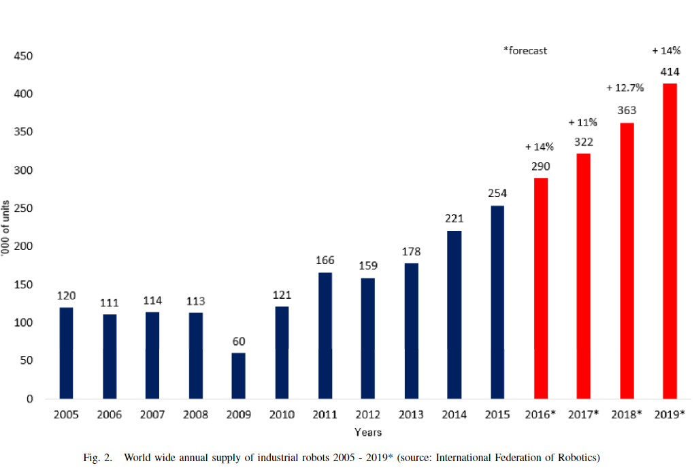

# Readings

## AI for All: Drawing Women into the Artificial Intelligence Field (2018)

Prives, L. (2018). AI for all: Drawing women into the artificial intelligence field. IEEE Women in Engineering Magazine, 12(2), 30-32. Dec. 2018, doi: 10.1109/MWIE.2018.2866890. [AI_for_all.pdf](AI_for_all.pdf).

The article tells the story of `Benna Ammanatha`, who started the _Women for AI_ to promote the tech industry toward more diversity and inclusion.  

> "We  put  a  lot  of  focus  on  computer  programming  right  now,  but  the  type  of  programming  we  do  today  will go away," predicts Ammanath. "With the  advances  in  voice  recognition,  you  might be able to just describe something to  an  AI  product,  and  it  will  program  for  you."  Before  we  get  there,  though,  Ammanath says, "I think it’s important for my kids to understand how Alexa and Siri actually work."

## Artificial Intelligence: Are We All Going to Be Unemployed (2018)

A. Sandybayev, "Artificial Intelligence: Are We All Going to Be Unemployed?," 2018 Fifth HCT Information Technology Trends (ITT), Dubai, United Arab Emirates, 2018, pp. 23-27, doi: 10.1109/CTIT.2018.8649521. [AI_and_unemployment](AI_and_unemployment.pdf).

According to Pricewaterhouse Coopers, new technologies will cut specific job markets, perhaps by 20%.  However, those same technologies will grow the spectrum of new opportunities.  For instance, people that have a disability, learning impedement, or communication deficiency might no longer be handicapped.

One of the challenges with this statement, is that the evolution of machines crosses mechanical to technical to feelings (see Feelings Paper Week1).  This means that during the initial phase, machines are doing to displace low-skilled worker numbers without addressing the job creation that follows in step 2.

## Artificial Intelligence in Politics: Establishing Ethics (2019)

T. B. Kane, "Artificial Intelligence in Politics: Establishing Ethics," in IEEE Technology and Society Magazine, vol. 38, no. 1, pp. 72-80, March 2019, doi: 10.1109/MTS.2019.2894474. [AI_in_Politics.pdf](AI_in_Politics.pdf).

The article describes the impact of social media advertising systems, like Facebook on election cycles.

> A Facebook digital marketing strategy tends to be a `Segmentation-Targeting-Positioning`  (STP)  strategy  [4],  whereby,  a  marketing  team  will  use  tools  to  segment  a  population  into  different  groups  according  to  various  characteristics,  such as, for example male, single father, age under 30. Tar-geting  is  the  process  of  selecting  one  or  more  of  the  seg-ments  to  work  on.  Positioning  is  the  process  of  detailing  how members of the segment will be approached and what strategy will be used to bring the task to completion. Face-book  allows  business  customers  to  position  materials  directly  to  Facebook  users  while  they  are  active  in  their  social networks, and even while they are on other platforms.

The authors continue with a focus on _Facebook for Politics_ (FfP) specifically noting:

> The  approach  adopted  here  is  to  view  social  network-ing  activities  from  a  theatrical  perspective  and  to  explore  the  steps  of  FfP  activity  as  play-within-a-play  activity  from  an  advanced  black-box  AI  entity.  The  FfP  black-box  entity  is compared with the Searle black-box entity and allows us to  draw  distinctions  that  posit  FfP  as  an  artificial  person  with  co-opted  features  of  human  intelligence.  This  paper  concludes  that  powerful  sociotechnical  AI  tools  such  as  FfP cannot be understood as traditional standalone AI sys-tems  and  need  to  be  policed  as  would  any  human  being  who  had  interests  and  abilities  to  influence  the  voting  intentions  of  hundreds  of  thousands  of  voters  simultaneously.

## Automation, per se, is not job elimination: How artificial intelligence forwards cooperative human-machine coexistence (2017)

O. H. Hamid, N. L. Smith and A. Barzanji, "Automation, per se, is not job elimination: How artificial intelligence forwards cooperative human-machine coexistence," 2017 IEEE 15th International Conference on Industrial Informatics (INDIN), Emden, 2017, pp. 899-904, doi: 10.1109/INDIN.2017.8104891. [AI_and_cooperation.pdf](AI_and_cooperation.pdf).

> Despite the gloomy scenario of automationas a job eliminator, we argue humans and machines can cross-fertilise in a way that  forwards  a  cooperative  coexistence.  Webuild our argument on three pillars: (i) the economic mechanism of  automation,  (ii) the dichotomy of  'experience' that separatesthe first-person perspective of humans from artificial learningalgorithms, and (iii)  the  interdependent  relationship betweenhumans and machines.

There is a lot of debate around the potential benefits of increased automation, however there is a common fear that these increases to productivity will _cause the rich to get richer and the poor to get poorer_.

> Predictions for jobs at risk range from a figureof 9% in the upcoming 1-2 decades to 47%[4]. It  is worthsaying that many jobs are  likely to change but not disappearowing to the automation of associated tasks [13]. In addition, it appears wage inequality between high- and low-skilled jobs will  exacerbate.  For instance, in the U.S. AI would pressure 83% of jobs paying $20or less an hour in contrast to  only 4% paying $40 or more (pg 899).

The `robot density` is an international benchmark that compares the number of robotic units deployed in the labor market per 10k human employees (see Figure 2).  While this is leading to an uptick in unemployement in specific areas like Bank Tellers -- it also enhances other aspects like Amazon fulfillment centers.

There are numerous examples of where human enhanced systems are superior to raw artificial intelligence.

> The  argument  had  always  beenthat machine intelligence playing chess against a human GrandMaster  was  merely  a  combination  of  computational  prowessand  probabilistic  search  algorithms.  Kasparov  suggested  ex-tending  the game  through what  was called  ‘advanced chess’,a version in which human players play against each other whilebeing assisted by computer software. Each of the games lastedfor  60 minutes,  which meant  that a  human player  had  to cutthe search algorithm when it took longer than it should have inorder not to lose technically. The surprising result was that atournament organized in 1998 was won by a team of amateurswho were skilled at integrating machine assistance [36]. Smartamateurs could even beat Hydra, a supercomputer better thanDeep Blue, by using analytic skill sets. It was thecombinationof strategic guidance with tactical acuity that gave victory.

## EU Ethics Guidelines for Trustworthy AI (2019)

Lemonne, E. (2018, December 17). Ethics Guidelines for Trustworthy AI. Retrieved August 17, 2019, from FUTURIUM - European Commission website. [WebSite](https://ec.europa.eu/futurium/en/ai-alliance-consultation). [EthicsGuidelinesforTrustworthyAI](EthicsGuidelinesforTrustworthyAI.pdf).

> The aim of the Guidelinesis to promote TrustworthyAI. TrustworthyAI has **three components**, which should be met  throughout  the  system's entire  life  cycle:(1) it  should  be **lawful**, complying withall applicable lawsandregulations(2) it should be **ethical**, ensuring adherence toethical principles and values and (3) it should be **robust**, both  from a technical and social perspectivesince, even  with  good  intentions, AI systems can cause unintentional harm. Each  component in itself is necessary but not sufficient for the achievement of TrustworthyAI. Ideally, all threecomponents  work in harmony and overlap in their operation. If, in practice, tensions arise between these components, society should endeavour to align them.

## A legal perspective on the trials and tribulations of AI: how artificial intelligence, the internet of things, smart contracts, and other technologies will affect the law (2018)

Giuffrida, I., Lederer, F., & Vermeys, N. (2018). A Legal Perspective on the Trials and Tribulations of Ai: How Artificial Intelligence, the Internet of Things, Smart Contracts, and Other Technologies Will Affect the Law. Case Western Reserve Law Review, 68(3), 747–781. [EBSCO](https://search-ebscohost-com.proxy1.ncu.edu/login.aspx?direct=true&db=tsh&AN=130372095&site=eds-live). [Legal_and_AI.pdf](Legal_and_AI.pdf).

With every technology there are legal challenges that come from attempting to fit the abstract concepts into the complex and opaque legal language which has exactly one-meaning per word.  These discrepencies introduce requirements into artifical intelligence systems that do not always make sense.

> The  principal  difficulty  which  this  case  has  given  me  arises from  the  anthropomorphic  character  of  virtually  everything that  is  thought  or  said  or  written  about  computers. Words    like   “language”,    “memory”,    “understand”, “instruction”,  “read”,  “write”,  “command”,  and  many  others are  in  constant  use.  They  are  words  which,  in  their  primary meaning,  have  reference  to  cognitive  beings.  Computers  are not  cognitive.  The  metaphors  and  analogies  which  we  use  to describe their functions remain just that. (pg. 756)

For instance, Google's algorithms erroneously declared Obama was a muslim.  Should they be liable for slander or some other tort? On the one hand, the technology is spreading misinformation.  On the other hand, its a aggregation service that sees the world as patterns of 1s and 0s.

> Accordingly, the effective accuracy of an algorithm is dependent on both  the  programming  and  the  data.  This  dictates  a  further,  legally- troubling  conclusion.  If there  are  doubts  about  the  results  of an  algo­rithm,  one  can  at  least  theoretically  inspect  and  analyze  the  pro­gramming  that  makes  up  the  algorithm.  Given  the  volume  of  data available on the Internet, however,  it  may be impossible to adequately determine and inspect the data used by the algorithm (pg 755)

## Information Accountability Foundation (2020)

Information Accountability Foundation (2020). [WebSite](https://informationaccountability.org/publications/).

> This website is a global information policy think tank that works with regulatory authorities, policymakers, business leaders, civil society, and other key stakeholders around the world to help frame and advance data protection law and practice through accountability-based information governance.

## OECD Principles of Ethical AI (2019)

OECD (2019). OECD Principles of Ethical AI. Recommendation of the Council on Artificial Intelligence. [OECD.org](https://www.oecd.org/legal/legal-instruments.htm). [OECD-LEGAL-0449-en.pdf](OECD-LEGAL-0449-en.pdf).

The short read outlines a recommended model for governments to think about AI, based on experts spanning 50 interdeciplenary areas.  The mantra is similar to the EU's requests that policies have/contain:

- Human centred values and fairness
- Transparency and explainability
- Robustness, security, and safety
- Accountability

## Robots and AI at work: the prospects for singularity (2018)

Upchurch, M. (2018). Robots and AI at work: the prospects for singularity. New Technology, Work & Employment, 33(3), 205–218. doi:10.1111/ntwe.12124. [Robots_at_work.pdf](Robots_at_work.pdf).

The notion of robots replacing humans at work is by no means a novel concept.  There have been several points across the 19th centry that technology innovation sprouts suggests of "4-hour work days" and "15-hour work weeks" that transition the labor force soley toward STEM (Science, Technology, Engineering, and Math) roles.  However, this `singularity` did not come from electricity, nor silicon processors, nor the iPad.

> The main reasons given for the caution about the degree of disruption and transformation rest on the technical, legal and so-cial constraints to the introduction and activation of robotics and AI. `There is clearly a debate to be had, not only on the interpretation of data, but also on the  balance  between  disruption  of  the  labour  market,  and  its  potential  transformationinto  a  world  of  work  where  human  labour  is  redundant`.  There  are  concrete  reasons  why catastrophic views for the future of human labour might be treated with caution. As Nolan and Slater (2011) remark `‘The narratives are typically light on theory, resistant  to  grounded  historical  and  institutional  interrogation,  and  commonly  substitute  anecdote  for  searching  empirical  analysis’`.  A  more  grounded  ‘socio technical’  ap-proach  (MacKenzie  and  Wajcman,  1985)  is  needed  to  address  these  deficiencies  of  analysis  and  to  reveal  technical,  legislative,  economic  and  societal  constraints  to  the  process of change. The `beneficial effects of robots and AI to the employer may also be overstated, thus restraining adoption of such new technologies`. Productivity improve-ments, for example, may have only a short- term effect as gathering ‘capital-bias’ in the production process restrict the opportunities for the extraction of surplus value from the ‘living labour’ of human effort (Roberts, 2016). (pg. 206)

Instead of being replaced, humans workers are transitioning to more oversight roles.

> During a normal and otherwise smooth shift, a worker responsible for the ballet of eight welding and handling robots intervenes 20 to 30 times per shift—not because of technical incidents but in order to prevent them. Although human work declined quantitatively over the years, its qualitative role increased with automation (Pfeiffer, 2016: 16)
